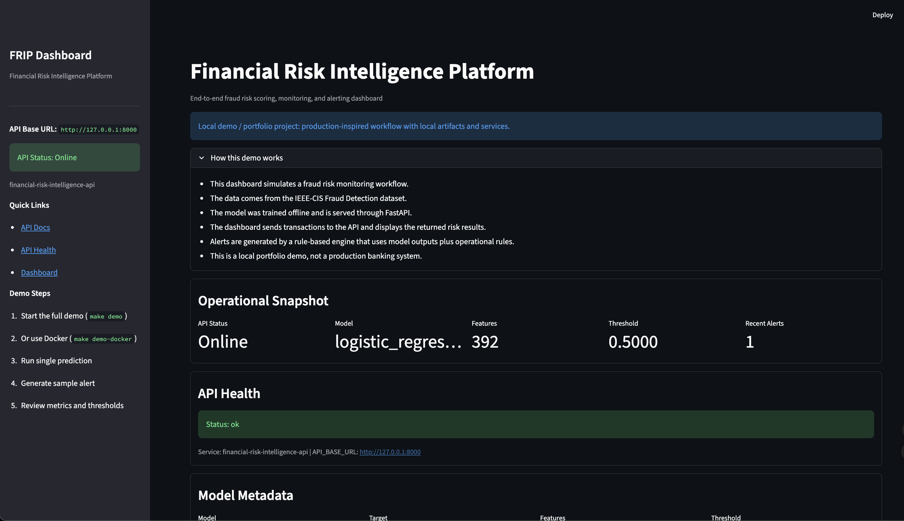
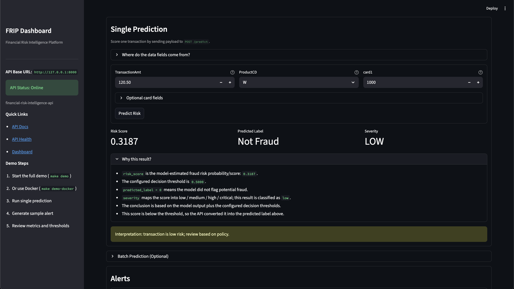
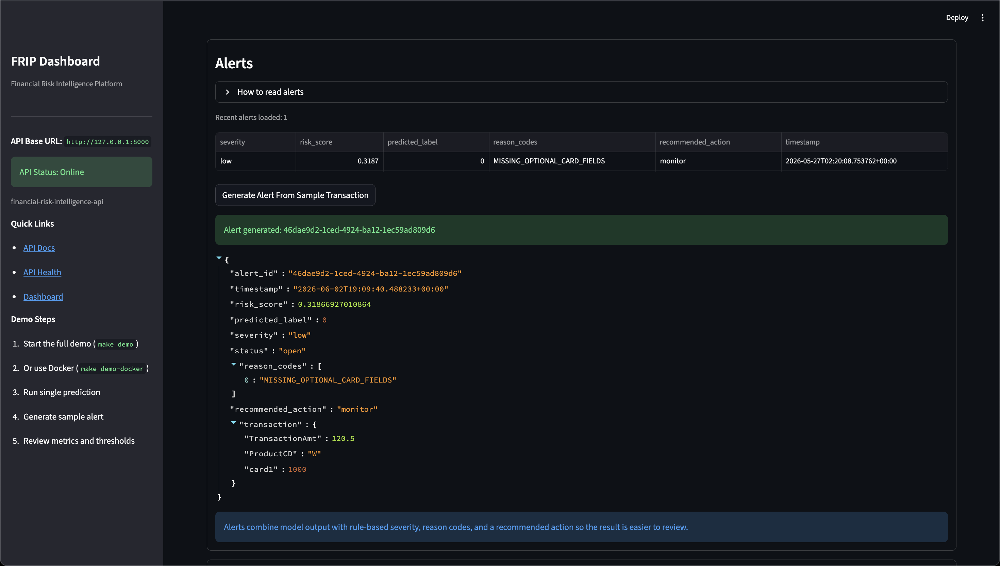
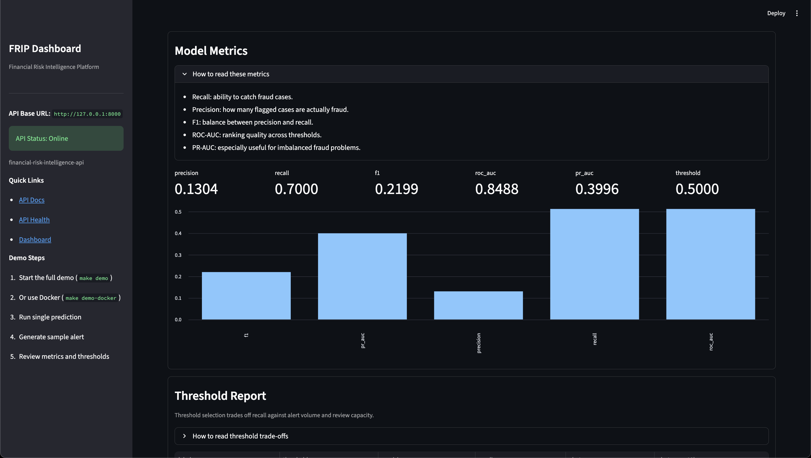
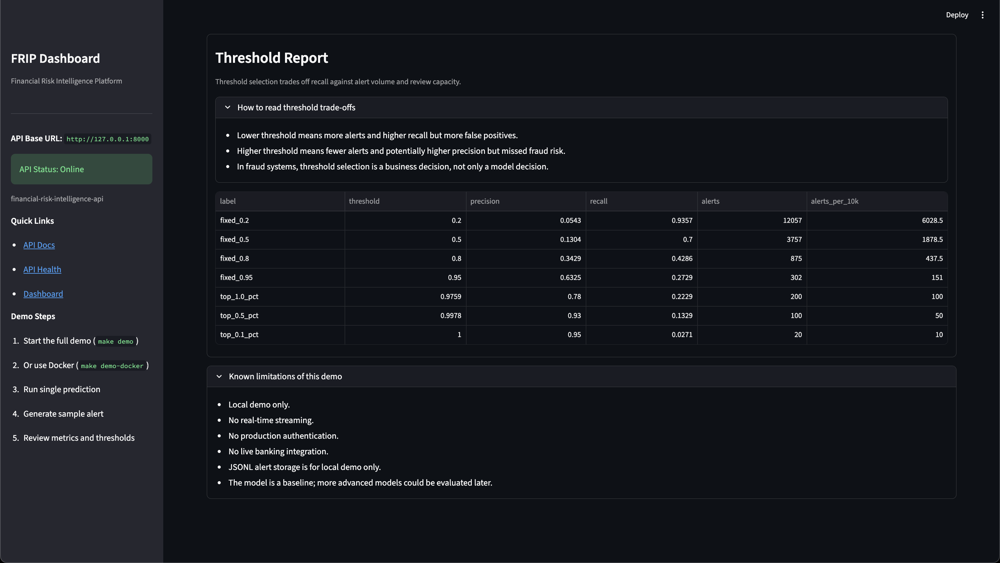
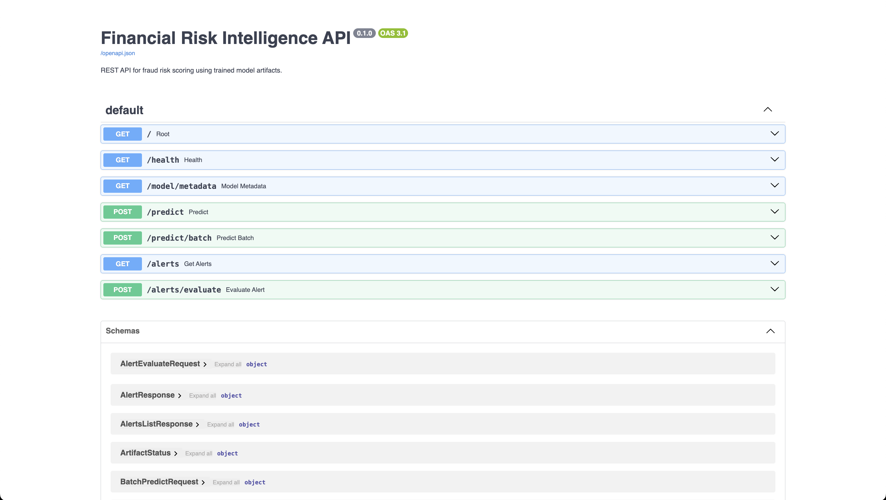
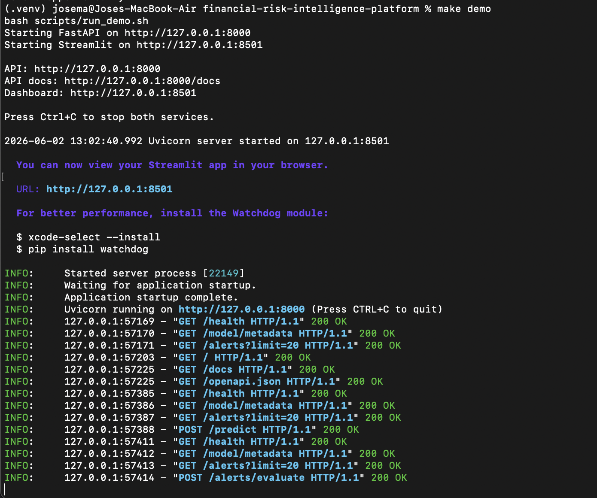
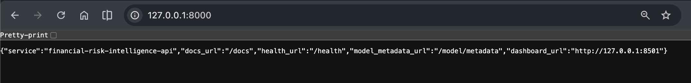

# Financial Risk Intelligence Platform

End-to-end fraud risk intelligence platform for portfolio and interview use. It demonstrates a full local workflow: data preparation, leak-safe feature engineering, reproducible scikit-learn modeling, FastAPI prediction endpoints, a Streamlit monitoring dashboard, and a rule-based alert engine.

[](https://github.com/Hotzh3/financial-risk-intelligence-platform/actions/workflows/ci.yml)

## Value Proposition

This project shows practical ML engineering beyond notebooks: model training + inference + API + dashboard + alerting + Docker + CI in one clean repository.

## Demo Preview

### Dashboard Overview



High-level operations view with API status, model metadata, alert counts, and the main fraud-risk workflow.

### Single Prediction



Shows the scoring form and the returned risk score, predicted label, and severity for one transaction.

### Alert Engine



Illustrates how model output is converted into analyst-friendly alerts with reason codes and recommended actions.

### Model Metrics



Summarizes the fraud-focused evaluation metrics used to judge model quality under class imbalance.

### Threshold Report



Shows how different thresholds trade off recall, precision, and review volume for operational decision-making.

### API Docs



FastAPI documentation for the health, metadata, prediction, and alert endpoints.

## Developer Experience

### Local Demo Terminal



One-command local demo flow that starts the API and dashboard together from a single terminal.

### API Root Response



Helpful landing response that points viewers to the docs, health check, metadata, and dashboard.

## Architecture

```text
Raw Transactions
→ Data Pipeline
→ Feature Engineering
→ ML Risk Model
→ FastAPI Prediction Service
→ Streamlit Dashboard
→ Alert Engine
→ Local JSONL Alert Storage
```

Docker Compose runs API + dashboard together for local demo usage.

## Key Features

- Leak-safe data and feature pipeline
- Reproducible `Pipeline` + `ColumnTransformer` modeling flow
- Fraud-focused metrics (precision, recall, F1, ROC-AUC, PR-AUC)
- Threshold tradeoff reporting for review-capacity decisions
- FastAPI prediction and metadata endpoints
- Streamlit operational dashboard
- Rule-based alert engine with reason codes and recommended actions
- Docker/Makefile local production-readiness workflow
- CI test execution via GitHub Actions

## Quickstart

### Run the full demo with one command

#### Local

```bash
make demo
```

`Ctrl+C` stops both the FastAPI and Streamlit processes cleanly.

#### Docker

```bash
make demo-docker
```

Docker Compose runs the API and dashboard together in one command.

#### Fallback

```bash
make api
make dashboard
```

### Manual Local Setup

```bash
make install
make test
make api
make dashboard
```

### Docker

```bash
make docker-up
make docker-down
make docker-logs
```

### URLs

- API base: http://127.0.0.1:8000
- API health: http://127.0.0.1:8000/health
- API docs: http://127.0.0.1:8000/docs
- Dashboard: http://127.0.0.1:8501

## API Endpoints

- `GET /health`
- `GET /model/metadata`
- `POST /predict`
- `POST /predict/batch`
- `GET /alerts`
- `POST /alerts/evaluate`

## Dashboard Overview

`dashboard/app.py` includes:

- API health panel
- model metadata panel
- single prediction panel
- batch prediction panel
- alerts panel
- model metrics panel
- threshold report panel

## Alert Engine Overview

- Rule-based alert generation from transaction + model signals
- Severity tiers + reason codes + recommended actions
- Local JSONL persistence (`reports/alerts.jsonl`, git-ignored)

## ML / Modeling Overview

- Dataset: IEEE-CIS Fraud Detection
- Target: `isFraud`
- Baseline model: logistic regression (config-driven)
- Preprocessing: imputation, scaling, one-hot encoding via sklearn pipeline
- Leakage prevention: excludes `TransactionID`, target, and configured drop columns

## Docker / CI

- `Dockerfile` for runtime image
- `docker-compose.yml` for API + dashboard orchestration
- `.dockerignore` to reduce build context
- `.github/workflows/ci.yml` runs `pytest -q`

## Portfolio / Interview Links

- [docs/portfolio_pitch.md](/Users/josema/Documents/financial-risk-intelligence-platform/docs/portfolio_pitch.md)
- [docs/linkedin_post.md](/Users/josema/Documents/financial-risk-intelligence-platform/docs/linkedin_post.md)
- [docs/cv_bullets.md](/Users/josema/Documents/financial-risk-intelligence-platform/docs/cv_bullets.md)
- [docs/interview_guide.md](/Users/josema/Documents/financial-risk-intelligence-platform/docs/interview_guide.md)
- [docs/demo_script.md](/Users/josema/Documents/financial-risk-intelligence-platform/docs/demo_script.md)
- [docs/release_notes_v1.md](/Users/josema/Documents/financial-risk-intelligence-platform/docs/release_notes_v1.md)

## Limitations

- Local deployment only
- No authentication/authorization layer
- No managed database or cloud deployment
- No real-time streaming pipeline
- No external alert channels enabled by default

## Future Improvements

- Probability calibration and cost-sensitive threshold selection
- Expanded temporal validation and drift monitoring
- Production security and observability hardening when deployment scope expands
- Managed persistence beyond local JSONL storage
